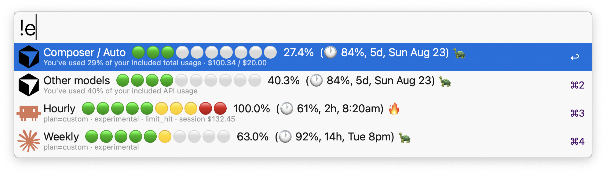

# Aeye 🦉
Keep an 👁️ on your **Cursor** and **Claude** usage — right from [Alfred](https://www.alfredapp.com/).

<div align="center">
  
</div>

<a href="https://github.com/giovannicoppola/alfred-aeye/releases/latest/">
<br/>
</a>



# Motivation ✅

- Quickly check how much of your AI quotas you’ve used without opening dashboards
- One keyword for both **Cursor** and **Claude**
- Four rows that match how the products report usage (Composer/Auto vs other models; hourly vs weekly)

# Features ✨

- **Four-row overview** — Composer/Auto, Other models, Hourly, Weekly with green → yellow → red circle meters
- **Cursor** — same split as the spending page; included spend vs limit; days until reset
- **Claude** — hourly (5h) session limit + weekly limit; Claude Code icon on the hourly row
- **Cached overview** (60s) — avoids re-hitting the APIs on every keystroke
- **Configurable** — keyword + checkboxes for which rows to show (all on by default)

# Setting up ⚙️

- macOS
- [Alfred](https://www.alfredapp.com/) 5 with Powerpack
- Python 3 (macOS `/usr/bin/python3` is fine; 3.9+)
- For Cursor rows: signed in to the **Cursor** app on this Mac
- For Claude rows: **Claude Code** signed in (OAuth in Keychain, or `~/.claude/.credentials.json`)
- Uncheck unused rows in **Configure Workflow** so you don’t need (or hit) a platform you don’t use

## Installation

1. Download the latest `.alfredworkflow` from [Releases](https://github.com/giovannicoppola/alfred-aeye/releases/latest)
2. Double-click to import into Alfred
3. Optional: open **Configure Workflow** to change the keyword or which rows to show
4. Optional: assign a hotkey

# Usage 📖

1. Type the keyword (default: `aieye`)
2. You’ll see the enabled rows (all four on by default):

### Overview (example)

```
Composer / Auto   🟢⚪⚪⚪⚪⚪⚪⚪⚪⚪  13.0%  (🕐 68%, 11d, Tue Aug 21) 🐢
                  … · $39.85 / $20.00

Other models      ⚪⚪⚪⚪⚪⚪⚪⚪⚪⚪  0.0%  (🕐 68%, 11d, Tue Aug 21) 🐢
                  …

Hourly            🟢⚪⚪⚪⚪⚪⚪⚪⚪⚪  6.0%  (🕐 40%, 5h, 11:30pm) 🐢
                  plan=… · experimental

Weekly            ⚪⚪⚪⚪⚪⚪⚪⚪⚪⚪  1.0%  (🕐 14%, 6d, Tue 8pm) 🎯
                  plan=… · experimental
```

- **Composer / Auto** / **Other models** — Cursor’s spending-page buckets (`autoPercentUsed` / `apiPercentUsed`)
- `$39.85 / $20.00` — included **compute spend** this cycle vs plan **included spend** limit (not necessarily what you are billed)
- `(🕐 68%, 11d, …)` — **% of the period elapsed**, then time until reset (`d` / `h` / `m`)
- Pace emoji after the parenthesis — compares % spent vs % elapsed: 🐢 underspending · 🎯 on track · 🔥 overspending (±8pp band)
- **Hourly** — Claude 5-hour session limit (Claude Code icon); reset suffix only while a session is active
- **Weekly** — Claude weekly limit

### Actions

| Shortcut | Action |
|----------|--------|
| ⏎ | Copy the selected row |
| ⌘⏎ | Open the service dashboard in the browser |

# Packages used 📦

Bundled with the workflow (no separate `pip install` for end users):

| Package | Role |
|---------|------|
| [cursor-usage](https://github.com/javaisbetterthanpython/cursor-usage) | Cursor cycle limits via your local Cursor session (Keychain / `state.vscdb` → `cursor.com`) |
| [Claude-Code-Usage-Monitor](https://github.com/Maciek-roboblog/Claude-Code-Usage-Monitor) (`claude-monitor`) | Claude limits via local Claude Code data + opt-in Anthropic OAuth usage API |

Claude percentages are labeled **`experimental`** when they come from Anthropic’s OAuth usage API (not Claude Code’s official statusline). **`official`** would require a statusline capture; **`local_estimate`** comes from local JSONL logs.

# Known issues ⚠️

- Claude weekly/hourly % need Claude Code auth on this machine; without it, those rows may show `n/a`
- Claude % come from Anthropic’s undocumented OAuth usage API (`experimental`); they can change shape without notice
- Cursor uses Cursor’s undocumented dashboard API; it can change without notice
- Overview cache lasts 60 seconds — force a refresh by waiting or clearing Alfred’s workflow cache

# Acknowledgments 😀

- [cursor-usage](https://github.com/javaisbetterthanpython/cursor-usage)
- [Claude-Code-Usage-Monitor](https://github.com/Maciek-roboblog/Claude-Code-Usage-Monitor)
- Brand marks via [Simple Icons](https://simpleicons.org/) (Cursor) and [Lobe Icons](https://github.com/lobehub/lobe-icons) (Claude, Claude Code)
- Owl workflow icon designed with [Google Gemini](https://gemini.google.com/)
- The [Alfred forum](https://www.alfredforum.com) community

## Security note

Both upstream packages are **vendored** in this repo (no surprise `pip install` at runtime). I reviewed them for unexpected behavior before bundling: they read local session/credentials and talk only to Cursor / Anthropic for usage data — no unrelated telemetry. Details: [SECURITY.md](SECURITY.md). That review is a snapshot in time; re-check if you update the vendored copies.

# Changelog 🧰

- 2026-08-18: version 0.1.0 — initial release (Cursor + Claude, four-row overview, 60s cache)

# Feedback 🧐

Feedback welcome — open an issue here or ping me on the [Alfred](https://www.alfredforum.com) forum.

# Development

For hacking on the workflow locally (symlink into Alfred’s workflows folder):

```bash
./scripts/bootstrap_lib.sh   # build src/lib from vendor/
ln -s "$(pwd)/src" \
  "$HOME/Library/Application Support/Alfred/Alfred.alfredpreferences/workflows/com.giovanni.alfred-aeye"
# or your synced Alfred.alfredpreferences/workflows path
```

Package a release artifact:

```bash
./scripts/build_workflow.sh   # → dist/Aeye.alfredworkflow
```
