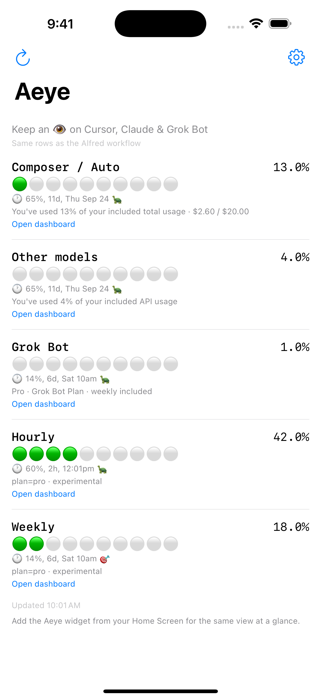
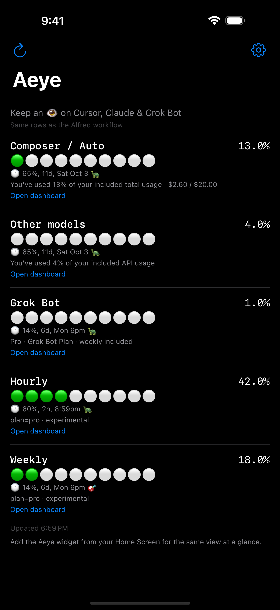
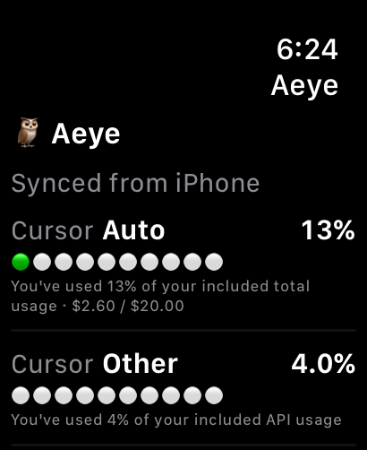
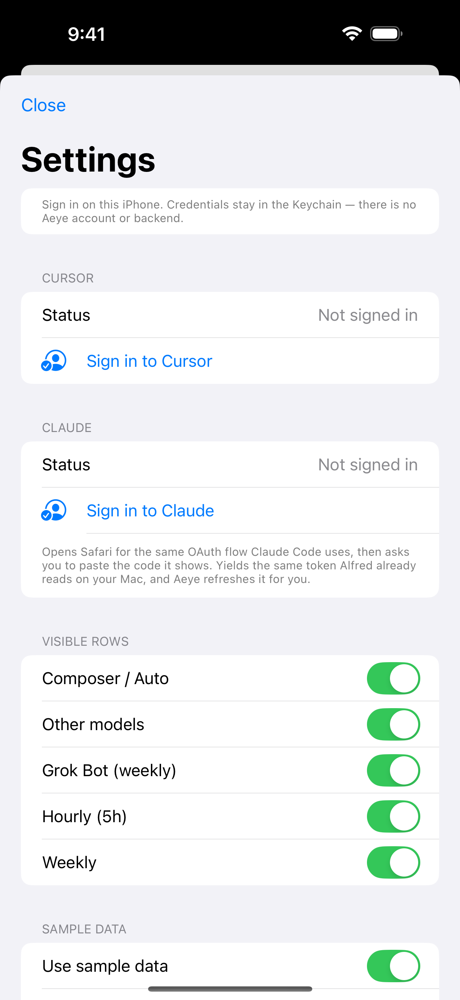
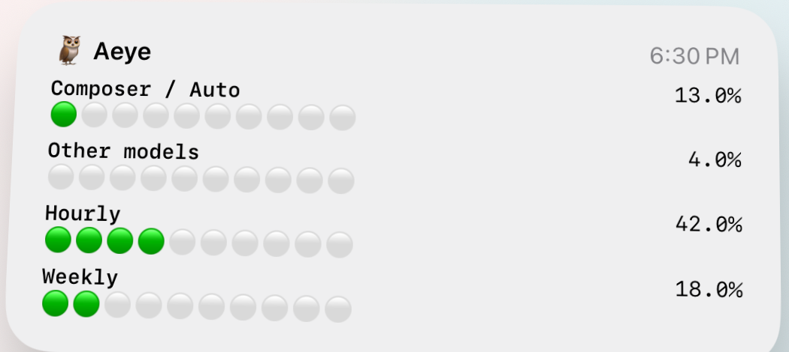

# Aeye iOS — iPhone, widget & Apple Watch

Free companion apps with the **same rows** as the [Alfred workflow](../README.md):

| Row | Source |
|-----|--------|
| Composer / Auto | Cursor spending page (`autoPercentUsed`) |
| Other models | Cursor (`apiPercentUsed`) |
| Grok Bot | Cursor weekly included Bot allowance (`get-sand-usage-status`) |
| Hourly | Claude 5-hour session limit |
| Weekly | Claude weekly limit |

Each row shows the **circle meter**, **percentage**, **period suffix**, and pace emoji matching Alfred.

## Surfaces

| Surface | What you get |
|---------|----------------|
| **iPhone app** | Full overview + Settings (tokens, row toggles) |
| **iPhone widget** | Medium or Large — same visible rows as the app |
| **Apple Watch app** | Compact list (5-dot meters, short labels) + on-wrist refresh |
| **Watch complications** | Circular / rectangular / inline / corner — focus row % |

The Watch does **not** store Cursor/Claude tokens. The iPhone fetches usage and pushes a snapshot over **WatchConnectivity**; the Watch caches it for offline glances and complications.

The Watch can also **pull**: the refresh button (toolbar or bottom of the list, or swipe down on the list) sends a request that wakes the iPhone app in the background, and the reply carries the fresh snapshot. Opening the Watch app does this automatically when the cached snapshot is more than two minutes old. If the iPhone is out of range the request is queued and delivered on the next connection.

## Requirements

- Xcode 15+ (Xcode 16 recommended)
- iPhone on iOS 17+
- Apple Watch on watchOS 10+ (optional)
- Apple Developer account — a free personal team is enough to sideload; the paid Apple Developer
  Program is required for TestFlight and the App Store
- Optional: [XcodeGen](https://github.com/yonaskolb/XcodeGen) to regenerate the Xcode project

## Screenshots

Captured from the simulator with `--screenshot` (a `#if DEBUG` launch argument that forces
``SampleDataMode`` on without writing the preference, so no real credentials are involved). These
images deliberately omit the "Sample data" chip — they depict the app as a signed-in user sees it.
Sizes match what App Store Connect expects.

| | |
|---|---|
|  |  |
| iPhone 6.9" — 1320 x 2868 | The same view in dark mode |
|  |  |
| Apple Watch Ultra — 410 x 502 | Settings — row toggles and the sample-data switch |



Medium Home Screen widget. `docs/screenshots/watch-overview.png` is the same Watch view at the
Ultra 3 size (422 x 514).

To regenerate:

```bash
xcrun simctl boot "iPhone 16 Pro Max"
xcodebuild -project Aeye.xcodeproj -scheme Aeye \
  -destination "platform=iOS Simulator,name=iPhone 16 Pro Max" -derivedDataPath DerivedData build
xcrun simctl install booted DerivedData/Build/Products/Debug-iphonesimulator/Aeye.app
xcrun simctl status_bar booted override --time "9:41" --batteryState charged --batteryLevel 100
xcrun simctl launch booted com.giovanni.aeye --screenshot
xcrun simctl io booted screenshot docs/screenshots/iphone-overview.png

# dark mode
xcrun simctl ui booted appearance dark
xcrun simctl launch booted com.giovanni.aeye --screenshot
xcrun simctl io booted screenshot docs/screenshots/iphone-overview-dark.png
xcrun simctl ui booted appearance light

# Settings — `--screenshot-settings` is `--screenshot` plus an already-open
# Settings sheet, so no tap has to be driven from outside the simulator
xcrun simctl launch booted com.giovanni.aeye --screenshot-settings
xcrun simctl io booted screenshot docs/screenshots/iphone-settings.png
```

Terminate the app (`xcrun simctl terminate booted com.giovanni.aeye`) between captures, or the
launch argument from the previous run stays in effect. If the status bar shows a `◀ AppName`
breadcrumb from an earlier app switch, `status_bar override` will not remove it — shut the
simulator down and boot it again.

Use an iOS 18.x runtime — the iOS 26 simulator runtime here ships without Apple Color Emoji, and
every meter dot renders as a placeholder box.

## Setup

### 1. Generate the Xcode project (if needed)

```bash
cd ios
brew install xcodegen   # once
xcodegen generate
open Aeye.xcodeproj
```

### 2. Signing & App Groups

1. Set your **Team** on **Aeye**, **AeyeWidgetExtension**, **AeyeWatch**, and **AeyeWatchWidgets**
2. Confirm App Groups (needed for the iPhone widget and Watch complications to share the last snapshot):
   - iPhone + iPhone widget: `group.com.giovanni.aeye`
   - Watch + Watch complications: `group.com.giovanni.aeye.watch`

Both groups are registered under team `VDG762YNX9`, so development *and* distribution builds sign
with them. If you build under a different team, register the two groups (or change the ids in the
matching entitlements and in `Shared/SnapshotStore.swift` / `Shared/WatchSnapshotCache.swift`) —
without them the app still runs, but the widget and complications have no snapshot to read.

The iPhone widget **reads the last snapshot** the app wrote. It does not call Cursor/Claude itself. Open the iPhone app to refresh; that also reloads the widget and pushes to the Watch.

### 3. Install on iPhone (Watch follows)

1. Select your **iPhone** as the run destination (not the Watch alone)
2. **Run** (`⌘R`) — Xcode installs the iPhone app and embeds the Watch app
3. On the Watch, open **Aeye** once after the iPhone has refreshed

Or from the command line — note that `xcodebuild` wants the hardware id from its own destination
list, which is *not* the UUID `devicectl` prints:

```bash
xcrun devicectl list devices                      # find your iPhone
xcodebuild -project Aeye.xcodeproj -scheme Aeye \
  -destination 'id=<hardware-id>' -derivedDataPath DerivedData \
  -allowProvisioningUpdates build
xcrun devicectl device install app --device <device-uuid> \
  DerivedData/Build/Products/Debug-iphoneos/Aeye.app
```

Unlock the phone before installing; a locked device also refuses `devicectl device process launch`.

### 4. Configure credentials (iPhone)

1. Open **Settings** (gear)
2. Tap **Sign in to Claude** — it opens Safari for the same OAuth flow Claude Code uses, then asks you to paste the code Claude shows. Aeye stores the access *and* refresh token in the Keychain and renews them automatically.
3. Tap **Sign in to Cursor** — same idea, in Safari. Cursor's flow reports back on its own, so there is nothing to paste; just finish signing in and return to Aeye.
4. Choose which rows to show
5. Tap **Save row choices** — refresh also syncs to the Watch when reachable

### 5. Try it without signing in

**Settings → Sample data → Use sample data** fills every row with representative numbers, so you
can see the layout (and the widget, and the Watch) before connecting an account. The setup card
offers the same thing as "See it with sample data".

Every surface labels it — a "Sample data" chip in the app, "Sample" in the widget and on the Watch
— and signing in turns it off automatically. The choice lives in the App Group, so the widget and
the Watch follow the app. This is also how App Review sees a populated app without credentials.

### 6. Widgets & complications

**iPhone:** long-press Home Screen → Add Widget → **Aeye** (Medium or Large).

**Watch:** long-press the watch face → Edit → Complications → pick **Aeye**  
(or add the rectangular complication / Smart Stack widget).

## Architecture

```
Aeye/                 iPhone app (settings + overview + WCSession sender)
AeyeWidget/           iPhone WidgetKit extension
AeyeWatch/            watchOS app (overview + WCSession receiver / refresh requester)
AeyeWatchWidgets/     Watch complications (WidgetKit accessory families)
Shared/               Models, formatting, API clients, snapshot + watch bridge
Config/               Entitlements, extension Info.plists, privacy manifest
scripts/              archive.sh — App Store archive + export
```

- **No backend** — credentials in iPhone Keychain only
- **Privacy manifest** — `Config/PrivacyInfo.xcprivacy`, copied into all four bundles: no tracking,
  no collected data, one required-reason API (App Group `UserDefaults`, reason `1C8F.1`)
- **iPhone App Group** — shared JSON snapshot for the iPhone widget
- **Watch App Group** — last synced snapshot for Watch app + complications
- **WatchConnectivity** — iPhone → Watch push on each refresh; Watch → iPhone refresh request (background wake, snapshot in the reply)
- **Logic port** — `Shared/AeyeFormatting.swift` + `Shared/AeyeService.swift` mirror `src/aieye.py`

## Getting tokens

In-app sign-in is the normal path; both credentials live **only on iPhone**, in the Keychain.

Claude sign-in runs Claude Code's OAuth client (`claude.ai` authorize → `platform.claude.com` token exchange, PKCE) inside `ASWebAuthenticationSession`, so Google and other SSO providers work — they refuse to serve OAuth inside an embedded `WKWebView`. That client only registers the copy-the-code redirect, hence the paste step. The result is the same `sk-ant-oat01-…` token the Mac side reads from the `Claude Code-credentials` Keychain item; a claude.ai *browser session* is a different credential and will not work against `/api/oauth/usage`.

Cursor sign-in uses the browser login `cursor login` runs: Aeye opens `cursor.com/loginDeepControl` in `ASWebAuthenticationSession` and polls `api2.cursor.sh/auth/poll` until it returns the session JWT — the same token the IDE keeps in the `cursor-access-token` Keychain item. The dashboard cookie (`<sub>::<jwt>`) is derived from it.

The **Advanced** section still accepts a pasted token (e.g. from `claude setup-token`). Pasted tokens have no refresh token, so they expire without renewal.

## Release & App Store

```bash
./scripts/archive.sh            # archive + export -> build/export/Aeye.ipa
./scripts/archive.sh --upload   # …and send it to App Store Connect
```

Signing is already configured (team `VDG762YNX9`, automatic, `ExportOptions.plist` targeting
`app-store-connect`), and `ITSAppUsesNonExemptEncryption = false` in `Aeye/Info.plist` answers the
export-compliance prompt on every upload — Aeye only uses system HTTPS, which is exempt.

- **[docs/app-store-submission.md](docs/app-store-submission.md)** — the full runbook: portal
  setup, App Store Connect record, privacy labels, screenshot sizes, pre-submit checklist, and the
  two things most likely to get *this* app rejected (App Review cannot sign in to Cursor or Claude;
  third-party service and name use).
- **[docs/app-store-metadata.md](docs/app-store-metadata.md)** — paste-ready listing copy.
- **[docs/landing/privacy.html](docs/landing/privacy.html)** — the privacy policy App Store Connect
  requires a URL for.

## Known limitations

- A Watch refresh needs the iPhone in range; out of range it queues and the Watch keeps showing the cached snapshot (with its age)
- WatchConnectivity delivery is best-effort while devices are paired and unlocked
- Undocumented Cursor / Anthropic APIs may change without notice
- Complication focus row is currently the first visible row (usually Composer / Auto)
- Claude hourly pace suffix only when a session is marked active (same as Alfred); OAuth API may not report that

## License

Same as the parent [alfred-aeye](../README.md) project.
